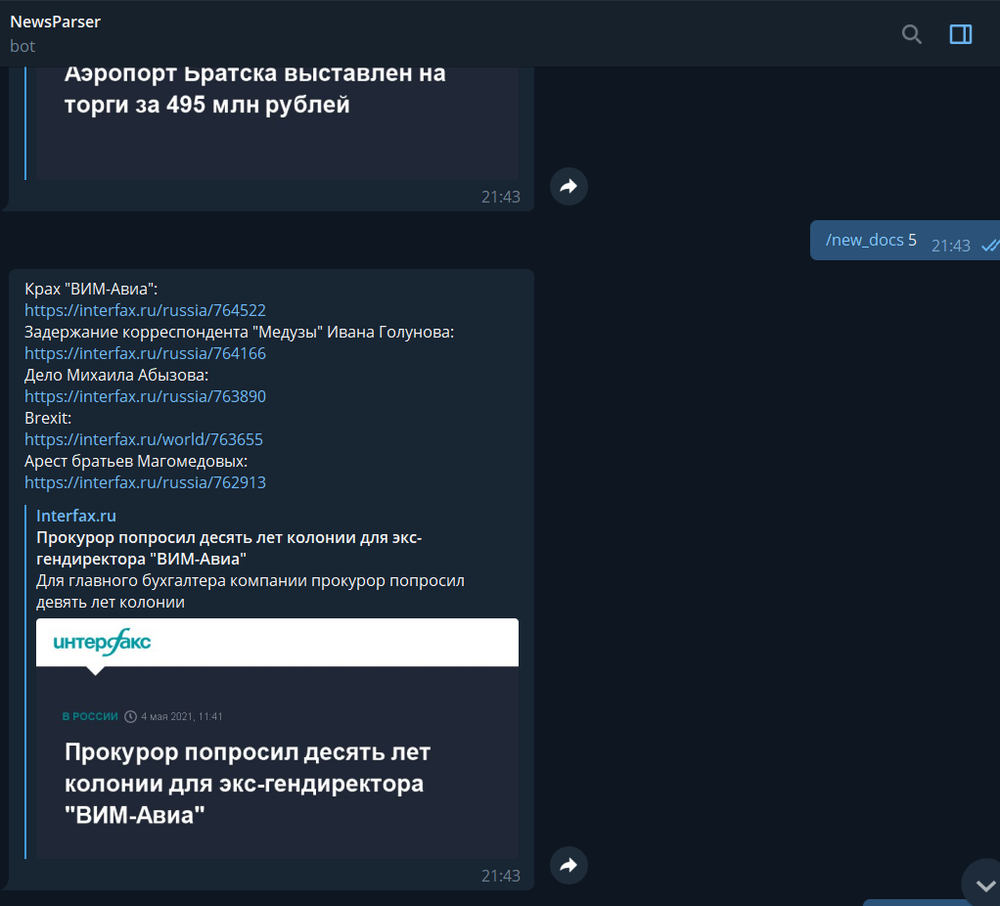
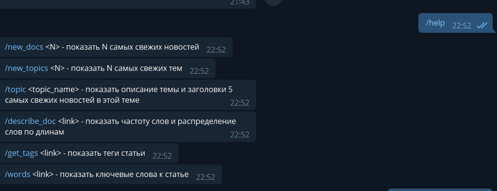
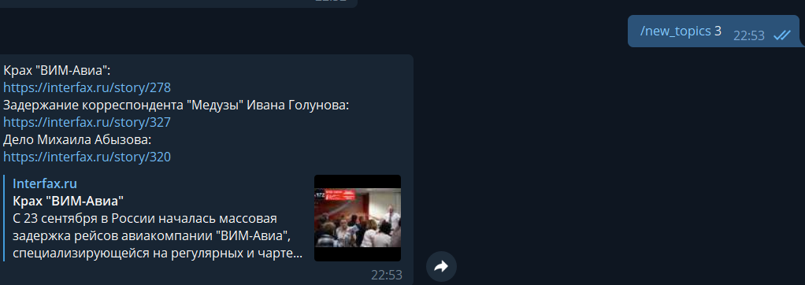
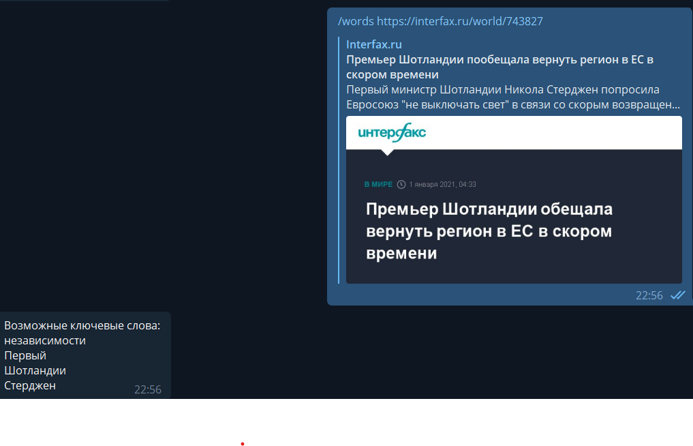
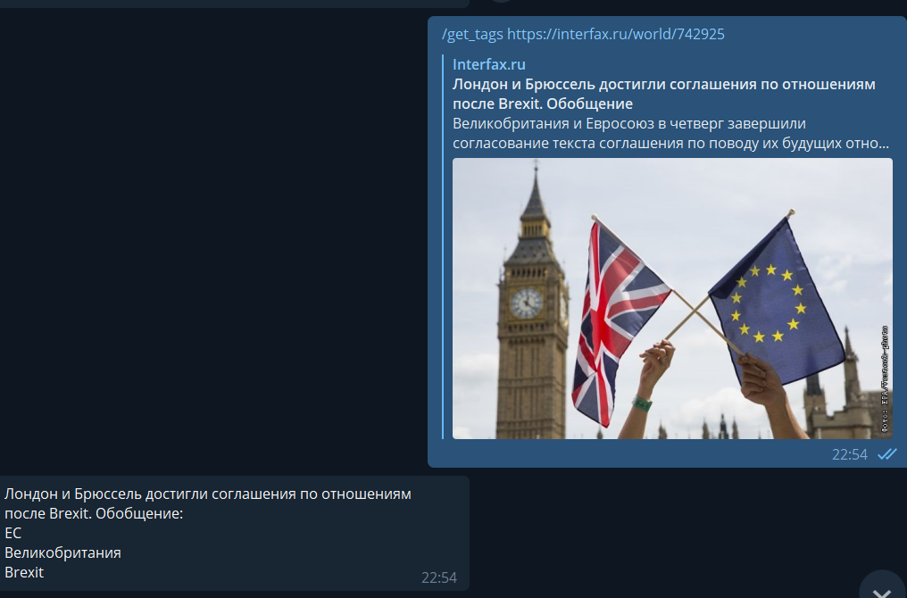

## Общая информация:

Программа предназначена парсинга новостного сайта https://interfax.ru, информация сохраняется в 
базе данных SQL, информация регулярно обновляется асинхронной функцией. Для взаимодействия с пользователем 
реализован телеграмм-бот с использованием библиотеки telebot - @NewsParser3000Bot. Также реализован анализ текста статей.

## Руководство по запуску:
1. Клонировать репозиторий и запустить main.py
2. В telegram найти бота - @NewsParser3000Bot
3. Протестировать команды из списка ниже:

## Команды для бота:
    /new_docs <N> - показать N самых свежих новостей
    /new_topics <N> - показать N самых свежих тем
    /topic <topic_name> - показать описание темы и заголовки 5 самых свежих новостей в этой теме
    /describe_doc <link> - показать частоту слов и распределение слов по длинам
    /get_tags <link> - показать теги статьи
    /words <link> - показать ключевые слова к статье

## Некоторые сценарии работы бота:

## Команды для запуска:

    git clone https://github.com/hknkrz/review_2

    python3 main.py
